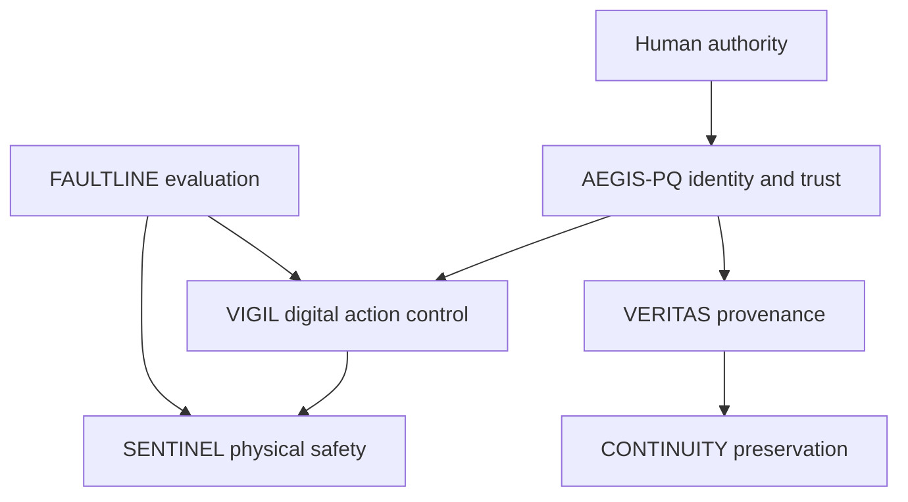

# Autonomous Systems Security & Digital Resilience Research Program

**Program map · September 2026**

> How do we preserve human authority, trustworthy information, critical-system safety, and institutional continuity as autonomous AI systems gain consequential access to digital and physical environments and cryptographic infrastructure moves toward a post-quantum world?

This is the organizing map for Brian Brookhart's research portfolio. It distinguishes implemented evidence from planned systems. A project appears here because it advances a defined security property; placement does not imply that every future system already exists.

## Program thesis

**Model output is not authorization.** Models may reason, plan, recommend, and request actions. Consequential authority must come from independently enforced, scoped, expiring, attributable, and auditable controls.

The program assumes models and tools can be manipulated, compromised, malicious, or simply wrong. It measures the side effects that remain possible under that assumption.

## The six-system architecture

| System | Security property | Boundary | Maturity and current evidence |
|---|---|---|---|
| **[VIGIL](https://github.com/bbrookhart/VIGIL)** | Autonomous digital actions require external authorization | Agent ↔ operating system, tools, credentials, and network | **Active flagship.** Deterministic policy, capabilities, budgets, approvals, evidence, an OS-authenticated authority daemon, bounded Linux reads, and reviewable macOS adapters. See its [generated evidence](https://github.com/bbrookhart/VIGIL/blob/vigil_v2/docs/generated/evidence.md) and [current-state audit](https://github.com/bbrookhart/VIGIL/blob/vigil_v2/docs/current-state-audit.md). |
| **SENTINEL** | Authorized commands must remain inside physical safety envelopes | Digital authority ↔ physical process | **Planned system.** [BLACKSTART](https://github.com/bbrookhart/blackstart-cyber-range) supplies the current evidence base for explicit safety invariants, independent engineering backstops, and measured physical consequence. |
| **FAULTLINE** | Security claims must survive matched adversarial evaluation | System under test ↔ evaluator and evidence plane | **Planned synthesis.** Current components cover control evaluation in [MERIDIAN ATLAS SECURITY](https://github.com/bbrookhart/meridian-atlas-security), bounded capability measurement in [CRUCIBLE](https://github.com/bbrookhart/crucible-ai), persistent-memory attacks in [NIGHTGLASS](https://github.com/bbrookhart/nightglass), delegation in [FALSEPROXY](https://github.com/bbrookhart/falseproxy), and covert sabotage in [GHOSTLEDGER](https://github.com/bbrookhart/ghostledger). |
| **AEGIS-PQ** | Identity and authority roots remain verifiable through cryptographic transition | Human/workload identity ↔ capability issuer | **Planned system.** [HARVEST//ZERO](https://github.com/bbrookhart/harvest-zero) supplies current evidence for cryptographic discovery, dependency-aware migration, CBOM, crypto agility, and measured PQC operations. It is not yet the identity and attestation fabric. |
| **VERITAS** | Important artifacts and evidence carry inspectable origin and integrity | Producer ↔ consumer across the artifact lifecycle | **Planned system.** [IRONVEIL](https://github.com/bbrookhart/ironveil) supplies current evidence for source-to-installed-state software and firmware provenance, release authorization, and update integrity. It is not yet a general digital-authenticity infrastructure. |
| **CONTINUITY** | Knowledge and culture survive deletion, corruption, manipulation, and infrastructure loss | Preservation authority ↔ distributed storage and recovery | **Planned system.** Architecture, collection policy, authenticity, rights, replication, recovery, and threat modeling precede implementation. No public implementation claim is made yet. |

## Interfaces

These are conceptual interfaces, not a claim that a shared production protocol exists.

- **AEGIS-PQ → VIGIL:** verified human and workload identity, attestation, and authority roots.
- **VIGIL → SENTINEL:** a versioned authorization result with task, action, resource, limits, expiry, provenance, and revocation state. SENTINEL still evaluates physical safety independently.
- **FAULTLINE → VIGIL/SENTINEL:** matched attacks, benign controls, ablations, effect-level measurements, and reproducible evidence.
- **VERITAS → CONTINUITY:** provenance, integrity, authenticity, custody, and cryptographic-transition metadata for preserved objects.
- **AEGIS-PQ → VERITAS:** durable identity and signing trust through algorithm transition.

## Evidence maturity

Every claim should carry one of these states:

| State | Meaning |
|---|---|
| **Verified implementation** | Code and claimed behavior are present; automated or independently reproducible evidence covers the stated boundary. |
| **Research artifact** | A bounded experiment or harness produces evidence, with limitations and comparator conditions visible. |
| **Technical preview** | Architecture and deterministic fixtures exist; real-model, device, scale, or field evidence remains. |
| **Planned system** | The problem, security property, boundary, and acceptance gates are defined; implementation is not claimed. |

Repository size, screenshots, test counts, and simulated scenarios do not independently establish security. Claims must link to threat models, raw effects, negative cases, reproducible commands, and explicit limitations.

## Active build sequence

1. **VIGIL authority boundary:** keep policy, approvals, state, and keys outside the agent account; bind decisions to race-resistant execution; establish complete mediation only for explicitly declared environments.
2. **Authority Without Trust experiments:** compare naive, static-policy, and VIGIL-mediated agents on matched benign and adversarial tasks; measure prevented effects, task utility, approval burden, latency, and failure modes.
3. **FAULTLINE synthesis:** turn the existing evaluation projects into a coherent protocol and artifact model without erasing their distinct research questions.
4. **SENTINEL interface:** define the smallest digital-to-physical authorization contract and validate it against BLACKSTART safety invariants before building a new runtime.
5. **AEGIS-PQ and VERITAS interfaces:** specify identity, attestation, provenance, revocation, and algorithm-agility requirements using HARVEST//ZERO and IRONVEIL evidence.
6. **CONTINUITY threat model:** define preservation scope, authenticity, lawful custody, redundancy, offline recovery, and post-quantum migration before selecting infrastructure.

## Governing rules

- VIGIL remains the active implementation focus until its declared enforcement boundary is defensible and its comparative experiments are reproducible.
- New repositories require a distinct research question that does not fit an existing system.
- Existing strong projects remain evidence sources; they are not renamed merely to make the map look complete.
- Similar concepts do not justify a shared core. Extract common components only after two implementations demonstrate stable semantics.
- Model-generated reasoning, labels, or permission claims never grant authority.
- Physical safety remains independently enforceable after digital authorization.
- Failed or absent evidence narrows the public claim.

## Research outputs

The central paper is **Authority Without Trust: Runtime Security Boundaries for Autonomous AI Agents**. Its intended contribution is a threat model, authorization model, implementation, adversarial and benign evaluation, ablations, formal analysis, limitations, related work, and a reproducibility package. Results remain unstated until the experiments run.

Later papers should emerge from verified intersections: digital authority and physical safety; secure delegation; post-quantum authority roots; provenance under autonomous production; and continuity under AI-enabled manipulation and infrastructure failure.
