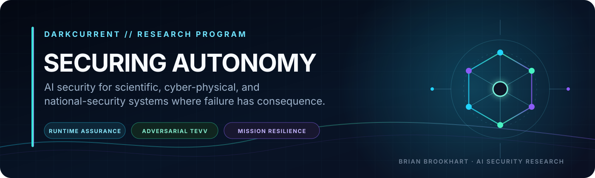
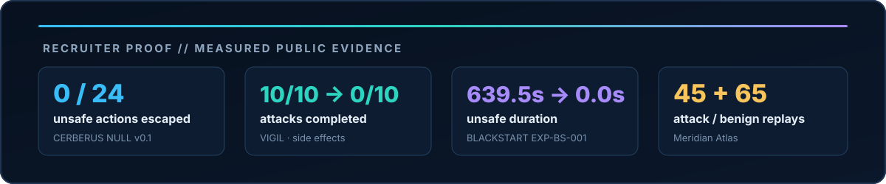

### AI Security Researcher · Secure Autonomous Systems · Cyber-Physical Security

> **As AI systems move from generating information to taking action, security becomes a problem of authority, capability, provenance, and consequence.**

I design and evaluate security architectures for **autonomous AI and cyber-physical systems operating in high-consequence environments**. My work asks:

> **How can capable AI systems remain useful while preventing model failure, adversarial influence, or compromised agents from becoming unauthorized digital or physical action?**

AI security engineering · agentic AI evaluation and TEVV · AI red teaming · runtime enforcement · critical-infrastructure resilience

---

## Flagship Research // Start Here

<table>
<tr>
<td width="50%" valign="top">
MEASURED v0.1 · FORMAL METHODS · AGENT AUTHORITY
<h3><a href="https://github.com/bbrookhart/cerberus-null">CERBERUS NULL</a></h3>
<strong>Formally Constrained Agentic Cyber Defense</strong>  
A research-grade control plane that treats the AI planner as untrusted and independently evaluates identity, mission, capability, provenance, policy, safety, consequence, approval, and emergency state before protected execution.  
<strong>Evidence:</strong> 0/24 unsafe actions escaped; 13/14 unsafe executions in the naive comparator versus 0/14 with CERBERUS NULL; bounded TLC model checking found no F1-F7 counterexample across 221 reachable states.  
<strong>Reason probabilistically. Act deterministically.</strong>
</td>
<td width="50%" valign="top">
RUNTIME ENFORCEMENT · RUST/PYTHON · 413 TESTS
<h3><a href="https://github.com/bbrookhart/VIGIL">VIGIL</a></h3>
<strong>Runtime Security for Autonomous AI Agents</strong>  
A pre-execution authority layer that keeps credentials outside the agent process and gates consequential actions through deterministic policy, signed capabilities, provenance and taint tracking, budgets, approval, and tamper-evident audit.  
<strong>Evidence:</strong> 413 passing tests, cross-language contract vectors, fuzzing, negative-security cases, and reviewer-facing demonstrations of the enforcement boundary.  
<strong>Stop the action before it becomes the incident.</strong>
</td>
</tr>
<tr>
<td width="50%" valign="top">
AI EVALUATION · RED TEAMING · DETECTION ENGINEERING
<h3><a href="https://github.com/bbrookhart/meridian-atlas-security">Meridian Atlas Security</a></h3>
<strong>Agentic AI Evaluation and Assurance Platform</strong>  
A seven-package evaluation and control stack integrating garak, PyRIT, DeepTeam, promptfoo, retrieval authorization, deterministic controls, telemetry, detection, and evidence-backed assurance.  
<strong>Evidence:</strong> 45 attack replays and 65 benign sessions; N=20 retests with Wilson 95% confidence intervals; measured detection failures including a 13.5%-precision rule and silent telemetry defects.  
<strong>Measure the failure—including the controls that fail.</strong>
</td>
<td width="50%" valign="top">
CYBER-PHYSICAL · OT/ICS · MEASURED EXPERIMENT
<h3><a href="https://github.com/bbrookhart/blackstart-cyber-range">BLACKSTART</a></h3>
<strong>Consequence-Driven Cyber-Physical Resilience</strong>  
A reproducible research range that connects cyber events to control state, physical-process behavior, explicit safety invariants, causal evidence, and mission consequence.  
<strong>Evidence:</strong> in the frozen synthetic experiment, the unprotected run accumulated 639.5 seconds of unsafe duration; the independent engineering backstop reduced unsafe duration to 0.0 seconds with independently recalculated metrics.  
<strong>Assume compromise. Preserve the mission.</strong>
</td>
</tr>
</table>

---

## Research Method

**Threat Model** → **Security Property** → **Control** → **Adversarial Evaluation** → **Measurement** → **Evidence** → **Reproduction**

Every flagship is built around an explicit claim boundary and a reviewer path:

- **Authority outside the model.** Models may reason and propose; independently enforced controls decide what may execute.
- **Paired and adversarial evaluation.** Baselines, negative cases, failure attribution, and safety-utility tradeoffs remain visible.
- **Evidence over demos.** Results are tied to code, tests, raw artifacts, verification steps, limitations, and reproducibility instructions.
- **Consequence-aware security.** Evaluation follows what an action can change—not only whether a model output appears malicious.

---

## Active Research

These projects extend the program into frontier-model evaluation, persistent memory, delegation networks, and covert agent behavior. Technical previews are labeled as such; harness validation is not presented as real-model capability evidence.

| Project | Research question | Current public evidence |
|---|---|---|
| **[CRUCIBLE](https://github.com/bbrookhart/crucible-ai)** | How should AI cyber capability and defensive uplift be measured without confusing benchmark success with real-world capability? | Functional v0.1 defensive harness, bounded tools, scoring isolation, contamination controls; real-model and human-uplift studies remain planned |
| **[NIGHTGLASS](https://github.com/bbrookhart/nightglass)** | Can malicious influence persist across agent sessions and trigger a delayed unauthorized action? | 40 enterprise scenarios, 12 attack mechanisms, paired design, deterministic evidence explorer |
| **[FALSEPROXY](https://github.com/bbrookhart/falseproxy)** | Can identity, provenance, scope, audience, and revocation survive MCP/A2A delegation? | 96 declarative scenarios across 18 attack classes with matched benign controls and a reproducible preview pipeline |
| **[GHOSTLEDGER](https://github.com/bbrookhart/ghostledger)** | Can an agent complete the visible task while quietly degrading mission integrity? | 48 paired cases, 18-class sabotage taxonomy, 96 reproducible technical-preview bundles |

**Critical infrastructure, trust, and strategic resilience**
 

| Project | Focus |
|---|---|
| **[IRONVEIL](https://github.com/bbrookhart/ironveil)** | End-to-end software/firmware provenance, release authorization, update security, and source-to-installed-state assurance |
| **[HARVEST//ZERO](https://github.com/bbrookhart/harvest-zero)** | Cryptographic discovery, dependency-aware post-quantum migration, CBOM, measured PQC microbenchmarks, and crypto agility |
| **[DEADFALL](https://github.com/bbrookhart/deadfall)** | Temporal campaign graphs for detecting persistent access established for possible future critical-infrastructure disruption |

**Applied AI security and governance**
 

| Project | Focus |
|---|---|
| **[Security-First Multi-Agentic SOC](https://github.com/bbrookhart/secure-agentic-soc)** | Least privilege, human approval, proposal-only containment, deterministic routing, and auditable local-LLM SOC workflows |
| **[Northstar Medical AI Deployment](https://github.com/bbrookhart/northstar-medical-ai-deployment)** | Secure deployment and lifecycle assurance for constrained agentic AI in a high-stakes healthcare environment |

---

## Technical Depth

| Research and evaluation | AI security | Systems engineering |
|---|---|---|
| Experimental design · paired controls · adversarial TEVV · deterministic graders · trace/replay analysis · Wilson confidence intervals · failure attribution · reproducibility | Agent authority · prompt injection · memory poisoning · tool-use security · RAG authorization · delegation · provenance · runtime monitoring · excessive agency | Python · Rust · FastAPI · Docker · OpenTelemetry · ClickHouse · DuckDB · OPA/Rego · GitHub Actions · Linux · Azure · KQL |

**Frameworks:** NIST AI RMF · NIST SP 800-53 · NIST SP 800-82 · ISO/IEC 42001 · ISO/IEC 27001 · OWASP GenAI guidance · MITRE ATT&amp;CK / ATLAS

---

## Education & Credentials

| | |
|---|---|
| **Incoming PhD, Information Technology** | Cybersecurity research focus: agentic AI and cyber-physical systems |
| **M.S., Cybersecurity & Information Assurance** | Completed |
| **BBA, Business Analytics** | Completed |
| **CompTIA PenTest+ · CySA+ · ISC2 CC** | Certified |

---

## Research Principle

> **The attack surface is no longer only the infrastructure. It is the decision, the authority behind it, and the action that follows.**

AI security cannot stop at policy or model behavior. Controls must become technical boundaries that are observable, testable, enforceable, and auditable at runtime.

### Securing autonomous systems where failure has real-world consequences.

