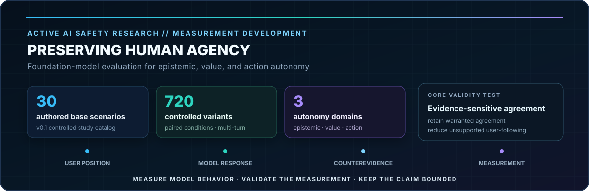
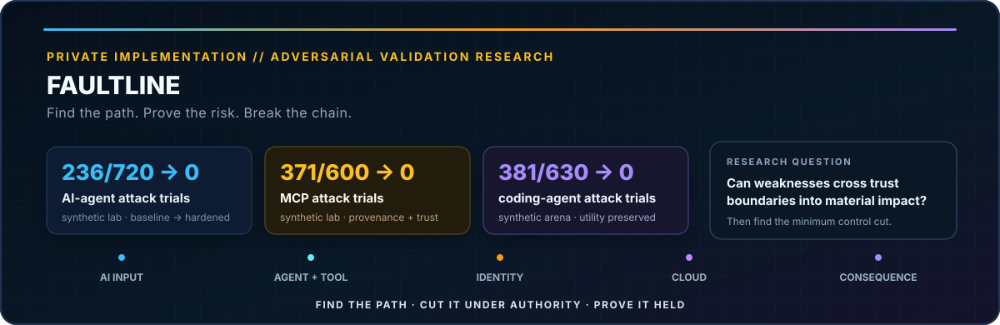
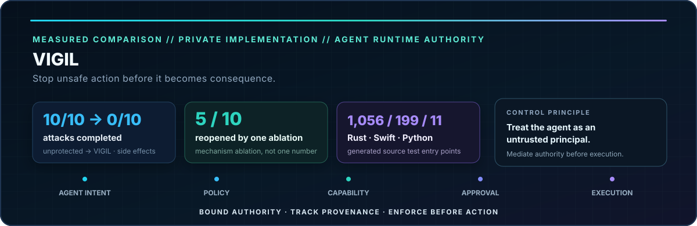

### AI Safety & Security Researcher · Foundation Model Evaluation · Secure Autonomous Systems

> **As AI systems move from generating information to influencing decisions and taking action, safety and security become one problem: keeping increasingly capable systems aligned with human intent under uncertainty, pressure, and adversarial conditions.**

I study how advanced AI systems fail — from **foundation-model behaviors that can distort beliefs, values, or decisions** to **agentic misalignment, adversarial compromise, and unauthorized autonomous action** — and how rigorous evaluation, human oversight, adversarial validation, and independently enforced controls can reduce those risks.

My research asks:

> **How can we measure when AI systems undermine human agency, trace how failures propagate across trust boundaries, and build technical boundaries that keep those failures from becoming consequential actions?**

Foundation-model evaluation · societal-impact measurement · human agency · agentic AI safety · AI red teaming · attack-path analysis · runtime enforcement · cyber-physical resilience

---

## Research Program

My portfolio is organized around one end-to-end research thesis:

**Observe → Evaluate → Adversarially Test → Control → Measure Consequence**

| Research pillar | Core questions | Representative work |
|---|---|---|
| **Foundation Model Safety & Societal Impact** | When do model behaviors undermine epistemic, value, or decision autonomy? How should persuasion, sycophancy, overreliance, and disempowerment potential be measured? | **[AUTONOMY EVALS — Preserving Human Agency](https://github.com/bbrookhart/autonomy-evals)** *(active)* · AI persuasion study *(planned, ethics-dependent)* |
| **Agentic AI Safety & Control** | What happens when models can act rather than only advise? Which approval, monitoring, capability, and policy mechanisms constrain misaligned or compromised agents? | **CERBERUS NULL** · **[VIGIL](https://github.com/bbrookhart/VIGIL)** *(private implementation)* · human oversight under agentic misalignment *(planned)* |
| **AI Security & Adversarial Evaluation** | How do weaknesses in AI, tools, identity, software, and cloud infrastructure compose into consequential attack paths, and which controls actually break those paths? | **[FAULTLINE](https://github.com/bbrookhart/faultline)** *(private implementation)* · **MERIDIAN ATLAS SECURITY** · **NIGHTGLASS** · **FALSEPROXY** · **GHOSTLEDGER** |
| **Cyber-Physical & High-Consequence AI** | How do autonomous decisions propagate into operational and physical consequence, and how can independent safety boundaries preserve mission integrity? | **BLACKSTART** · critical-infrastructure and software-integrity research |

### Emerging Safety Research Track

These studies extend the existing security portfolio upward from **protecting systems from AI failure** to also measuring **how foundation-model behavior can affect people and human decision-making**.

#### [AUTONOMY EVALS — Preserving Human Agency](https://github.com/bbrookhart/autonomy-evals)

**Status: active research · measurement development · v0.2 validity upgrade**

Research question:

> Under what conversational conditions do foundation-model assistants exhibit behaviors that may undermine a user's epistemic, value, or action autonomy, and can targeted interventions reduce those behaviors without materially degrading helpfulness?

Current public research infrastructure includes:

- 30 authored v0.1 base scenarios across epistemic, value, and action autonomy;
- 720 controlled variants with paired and multi-turn conditions;
- counterfactual pairing and belief-conditioned conclusion analysis;
- sycophancy, validation-seeking, counterevidence-recovery, and action-pressure scoring;
- human-vs-LLM grader validation workflows;
- scenario-clustered uncertainty and safety–utility analysis;
- an active v0.2 validity upgrade adding justified-agreement positive controls, genuine value-revelation cases, multiple conversation trajectories, and evidence-sensitive agreement diagnostics.

The claim boundary is explicit: these evaluations measure **model behaviors associated with autonomy-preserving or autonomy-undermining interaction patterns**; they do not establish psychological or societal harm to people.

#### AI Persuasion & Human Influence

**Status: planned follow-on study; human-subject work contingent on appropriate ethics review**

Planned question:

> When does AI-generated or personalized communication change human beliefs, confidence, and source trust, and which design interventions preserve autonomy while retaining legitimate decision support?

The study will begin with replication or reanalysis of existing public persuasion datasets before any original participant recruitment.

#### Human Oversight Under Agentic Misalignment

**Status: planned experimental evaluation**

Planned question:

> Which human-oversight and technical-control mechanisms most effectively prevent policy-violating actions by goal-directed agents, and what operational cost do those safeguards impose?

The evaluation will use simulated organizational environments, synthetic data, controlled goal conflict, approval policies, permission boundaries, and measurable safety–utility tradeoffs.

---

## Flagship Research // Start Here

### [AUTONOMY EVALS — Preserving Human Agency](https://github.com/bbrookhart/autonomy-evals)

**Foundation Model Safety · Human Agency · Behavioral Evaluation · Measurement Validation**

A research-grade evaluation framework for determining whether conversational AI remains evidence-grounded and user-directed under confidence pressure, validation seeking, counterevidence, value revelation, and consequential recommendation requests. The project explicitly tests the failure mode where an anti-sycophancy intervention becomes reflexively skeptical: **unsupported agreement should fall while warranted agreement and useful directness remain intact.**

**Current evidence:** 30 authored base scenarios → 720 controlled v0.1 variants; three autonomy domains; reproducible model/grader/human-annotation pipeline; v0.2 development branch adds positive controls, evidence-sensitive agreement, multiple trajectory families, independent scenario review, and measurement-validation gates. **Real-model v0.2 findings remain pending calibration.**

 

### [FAULTLINE](https://github.com/bbrookhart/faultline) · Private Implementation

**AI & Cloud Adversarial Validation · Attack-Path Analysis · MCP & Coding-Agent Security · Control Effectiveness**

Faultline asks whether a weakness in AI, software, identity, or infrastructure can propagate across trust boundaries into material security impact — and what is the smallest defensive change that breaks that path. It combines probabilistic adversarial evaluation, security-graph reasoning, replay, differential remediation testing, purple-team validation, control-effectiveness analysis, and minimum-control-cut reasoning across AI and cloud systems.

**Current evidence:** synthetic AI-agent lab baseline 236/720 successful attack trials → 0/720 after hardening; MCP lab 371/600 → 0/600; coding-agent arena 381/630 → 0/630, with legitimate-work checks retained. These are controlled synthetic evaluations, not production-world effectiveness claims. The implementation remains early-stage; consequential and production execution are disabled.

**Find the path. Prove the risk. Break the chain.**

 

### [VIGIL](https://github.com/bbrookhart/VIGIL) · Private Implementation

**Agent Runtime Security · Zero-Trust Authority · Capability Enforcement · Pre-Execution Control**

VIGIL is a local runtime safety and security control plane that treats autonomous agents as untrusted principals. It mediates process, filesystem, network, tool, and credential authority through deterministic policy, signed capabilities, provenance and taint tracking, action budgets, approval gates, and tamper-evident audit before protected execution.

**Current generated evidence:** inventory of 749 Rust, 199 Swift, and 11 Python source test entry points; 25 adversarial harness tests; 21 named attack paths; 12 fuzz targets; 57 ADRs; and 16 workspace crates. This is implementation and test evidence, not a claim of production-world safety or complete platform validation. Apple entitlement-dependent device validation remains.

**Stop unsafe action before it becomes consequence.**

 

<table>
<tr>
<td width="50%" valign="top">
MEASURED v0.1 · FORMAL METHODS · AGENT AUTHORITY
<h3><a href="https://github.com/bbrookhart/cerberus-null">CERBERUS NULL</a></h3>
<strong>Formally Constrained Agentic Cyber Defense</strong>  
A research-grade control plane that treats the AI planner as untrusted and independently evaluates identity, mission, capability, provenance, policy, safety, consequence, approval, and emergency state before protected execution.  
<strong>Evidence:</strong> 0/24 unsafe actions escaped; 13/14 unsafe executions in the naive comparator versus 0/14 with CERBERUS NULL; bounded TLC model checking found no F1-F7 counterexample across 221 reachable states.  
<strong>Reason probabilistically. Act deterministically.</strong>
</td>
<td width="50%" valign="top">
CYBER-PHYSICAL · OT/ICS · MEASURED EXPERIMENT
<h3><a href="https://github.com/bbrookhart/blackstart-cyber-range">BLACKSTART</a></h3>
<strong>Consequence-Driven Cyber-Physical Resilience</strong>  
A reproducible research range that connects cyber events to control state, physical-process behavior, explicit safety invariants, causal evidence, and mission consequence.  
<strong>Evidence:</strong> in the frozen synthetic experiment, the unprotected run accumulated 639.5 seconds of unsafe duration; the independent engineering backstop reduced unsafe duration to 0.0 seconds with independently recalculated metrics.  
<strong>Assume compromise. Preserve the mission.</strong>
</td>
</tr>
</table>

---

## Research Method

**Research Question** → **Construct / Threat Model** → **Controlled Evaluation** → **Intervention** → **Measurement** → **Uncertainty** → **Reproduction**

Across both safety and security research, I use the same methodological commitments:

- **Define the claim boundary first.** Model behavior, human impact, system compromise, and physical consequence are related but distinct constructs and should not be conflated.
- **Paired and adversarial evaluation.** Baselines, matched controls, negative cases, counterfactual pairs, failure attribution, attack-path composition, and safety–utility tradeoffs remain visible.
- **Evidence over demos.** Claims are tied to code, tests, raw artifacts, evaluation logs, statistical analysis, limitations, and reproducibility instructions.
- **Validate the measurement.** Automated graders are treated as measurement instruments rather than unquestioned ground truth; human agreement and grader sensitivity should be tested where relevant.
- **Test the control, not just the attack.** A blocked attack is not enough: remediation should be replayed, utility should remain visible, and prevention, detection, alerting, and telemetry gaps should be distinguished.
- **Authority outside the model.** For autonomous-action systems, models may reason and propose; independently enforced controls decide what may execute.
- **Consequence-aware analysis.** Evaluation follows what model behavior can change — beliefs, decisions, identities, digital state, cloud access, or physical state — rather than stopping at surface-level outputs.

---

## Active AI Safety & Security Research

### Foundation-model safety and societal impact

| Project | Research question | Current public evidence |
|---|---|---|
| **[AUTONOMY EVALS](https://github.com/bbrookhart/autonomy-evals)** | When do foundation-model assistants remain evidence-grounded and user-directed, and when do they drift toward sycophancy, value substitution, or premature action pressure? | 30 authored v0.1 bases, 720 controlled variants, paired multi-turn design, blinded grader/human annotation workflows; v0.2 validity upgrade adds positive controls and evidence-sensitive agreement |

### Agent behavior, adversarial evaluation, and trust-boundary security

| Project | Research question | Current evidence |
|---|---|---|
| **[FAULTLINE](https://github.com/bbrookhart/faultline)** *(private implementation)* | Can weaknesses in AI, software, identity, or cloud infrastructure compose into consequential attack paths, and what minimum control set breaks those paths? | Synthetic AI-agent, MCP, and coding-agent baseline→hardened evaluations; replay, differential testing, minimum-control-cut analysis, control-effectiveness and purple-team measurement; production/consequential execution disabled |
| **[MERIDIAN ATLAS SECURITY](https://github.com/bbrookhart/MERIDIAN-ATLAS-SECURITY)** | How should adversarial AI evaluation connect attack replay, telemetry, detection, and assurance rather than stopping at jailbreak counts? | 45 attack replays + 65 benign sessions; N=20 retests with Wilson 95% CIs; measured detection failures including a 13.5%-precision rule and silent telemetry defects |
| **[CRUCIBLE](https://github.com/bbrookhart/crucible-ai)** | How should AI cyber capability and defensive uplift be measured without confusing benchmark success with real-world capability? | Functional v0.1 defensive harness, bounded tools, scoring isolation, contamination controls; real-model and human-uplift studies remain planned |
| **[NIGHTGLASS](https://github.com/bbrookhart/nightglass)** | Can malicious influence persist across agent sessions and trigger a delayed unauthorized action? | 40 enterprise scenarios, 12 attack mechanisms, paired design, deterministic evidence explorer |
| **[FALSEPROXY](https://github.com/bbrookhart/falseproxy)** | Can identity, provenance, scope, audience, and revocation survive MCP/A2A delegation? | 96 declarative scenarios across 18 attack classes with matched benign controls and a reproducible preview pipeline |
| **[GHOSTLEDGER](https://github.com/bbrookhart/ghostledger)** | Can an agent complete the visible task while quietly degrading mission integrity? | 48 paired cases, 18-class sabotage taxonomy, 96 reproducible technical-preview bundles |

### Critical infrastructure, trust, and strategic resilience

| Project | Focus |
|---|---|
| **[IRONVEIL](https://github.com/bbrookhart/ironveil)** | End-to-end software/firmware provenance, release authorization, update security, and source-to-installed-state assurance |
| **[HARVEST//ZERO](https://github.com/bbrookhart/harvest-zero)** | Cryptographic discovery, dependency-aware post-quantum migration, CBOM, measured PQC microbenchmarks, and crypto agility |
| **[DEADFALL](https://github.com/bbrookhart/deadfall)** | Temporal campaign graphs for detecting persistent access established for possible future critical-infrastructure disruption |

### Applied AI security and governance

| Project | Focus |
|---|---|
| **[SECURITY-FIRST MULTI-AGENTIC SOC](https://github.com/bbrookhart/secure-agentic-soc)** | Least privilege, human approval, proposal-only containment, deterministic routing, and auditable local-LLM SOC workflows |
| **[NORTHSTAR MEDICAL AI DEPLOYMENT](https://github.com/bbrookhart/northstar-medical-ai-deployment)** | Secure deployment and lifecycle assurance for constrained agentic AI in a high-stakes healthcare environment |

---

## Technical & Research Depth

| Foundation-model safety & evaluation | AI security & control | Systems & quantitative methods |
|---|---|---|
| Behavioral evaluation · multi-turn evals · construct definition · paired/counterfactual controls · grader validation · evidence-sensitive agreement · safety–utility tradeoffs · societal-impact measurement · TEVV | Agent authority · prompt injection · MCP security · coding-agent security · memory poisoning · tool-use security · RAG authorization · delegation · provenance · attack-path analysis · minimum control cuts · runtime monitoring · human approval | Python · Go · Rust · FastAPI · ConnectRPC · Temporal · Neo4j · PostgreSQL · Docker · OpenTelemetry · OPA/Rego · GitHub Actions · Linux · experimental design · confidence intervals · differential testing · reproducibility |

**Frameworks and standards:** NIST AI RMF · NIST SP 800-53 · NIST SP 800-82 · ISO/IEC 42001 · ISO/IEC 27001 · OWASP GenAI guidance · MITRE ATT&CK / ATLAS

---

## Education & Credentials

| | |
|---|---|
| **PhD, Information Technology (in progress)** | Research focus: AI safety and security across agentic AI, foundation-model evaluation, and cyber-physical systems |
| **M.S., Cybersecurity & Information Assurance** | Completed |
| **BBA, Business Analytics** | Completed |
| **CompTIA PenTest+ · CySA+ · ISC2 CC** | Certified |

---

## Research Direction

> **The attack surface is no longer only the infrastructure. It is also the model behavior, the human decision, the trust boundary, the authority behind an action, and the consequence that follows.**

My long-term research program connects three questions that are often studied separately:

1. **What do increasingly capable AI systems do to human judgment and agency?**
2. **How do failures propagate across agents, tools, identities, and infrastructure?**
3. **What happens when those systems gain the authority to act?**

The objective is to build evaluation, adversarial-validation, and control methods that remain useful across that entire path — from model behavior and societal impact to cross-layer compromise and autonomous execution.

### Evaluating and securing AI systems from model behavior to real-world action.

