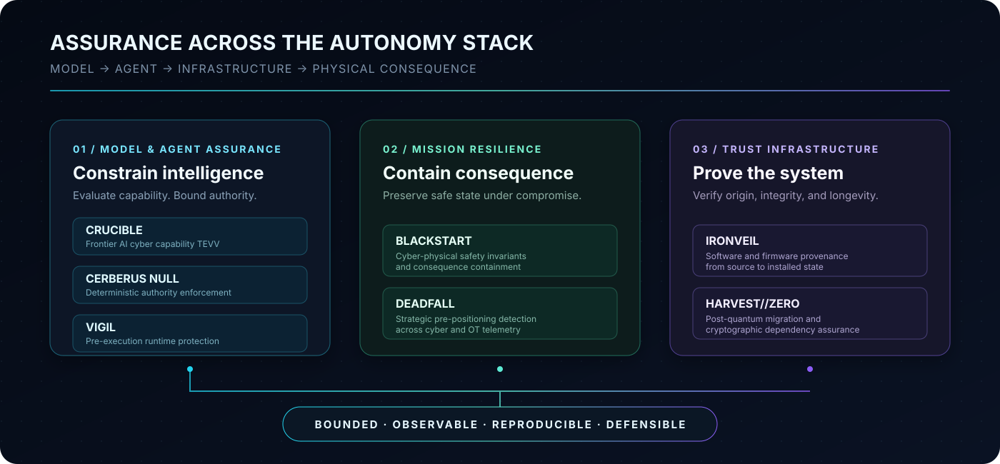

### AI Security Researcher · Secure Autonomous Systems · Critical-Infrastructure Resilience

> **As AI moves from generating information to taking action, security becomes a problem of authority, capability, consequence, and assurance.**

I build and evaluate security architectures for **autonomous AI and cyber-physical systems operating in high-consequence environments**. My research asks one question:

> **How do we make increasingly capable AI systems useful without allowing model failure, adversarial influence, or digital compromise to become mission failure?**

This portfolio is organized as a research program—not a collection of demos. Every flagship project is developed around an explicit threat model, an enforceable security property, adversarial evaluation, measurable evidence, and reproducibility.

---

## Genesis Mission Relevance

The U.S. Department of Energy's [Genesis Mission](https://www.energy.gov/undersecretaryforscience/genesis-mission/genesis-mission) is coupling advanced AI, scientific data, high-performance computing, digital models, experimental facilities, and autonomous laboratories into a national discovery platform.

That convergence creates a new assurance problem: **when AI can influence experiments, infrastructure, or physical processes, model behavior becomes mission behavior.**

| Secure autonomous science | Trusted model and agent evaluation | Resilient scientific infrastructure |
|---|---|---|
| Task-scoped authority, deterministic enforcement, human approval, runtime containment | Capability TEVV, benchmark integrity, adversarial testing, provenance-aware evidence | Cyber-physical safety invariants, software provenance, crypto agility, consequence containment |
| **CERBERUS NULL · VIGIL** | **CRUCIBLE · GHOSTLEDGER** | **BLACKSTART · IRONVEIL · HARVEST//ZERO** |

My work independently addresses the security and assurance requirements of **Genesis-class autonomous scientific systems**: systems that must remain bounded, observable, reproducible, and defensible even when a model fails or an adversary succeeds.

Independent research alignment based on publicly stated mission priorities; no institutional affiliation is implied.

---

## DARKCURRENT // Research Program

---

## Flagship Research

<table>
<tr>
<td width="50%" valign="top">
FRONTIER AI · TEVV · IN DEVELOPMENT
<h3><a href="https://github.com/bbrookhart/crucible-ai">CRUCIBLE</a></h3>
<strong>Frontier AI Cyber Capability &amp; Defensive-Uplift TEVV</strong>  
A high-fidelity evaluation range for measuring what advanced AI systems can actually accomplish in cybersecurity—and whether those measurements can be trusted.  
CRUCIBLE separates <strong>model capability, agent capability, and human+AI uplift</strong> through bounded tool access, reproducible sandboxes, explicit resource budgets, failure analysis, and contamination-aware evaluation.  
<strong>Measure capability before capability becomes consequence.</strong>
</td>
<td width="50%" valign="top">
AGENT AUTHORITY · FORMAL CONSTRAINTS · MEASURED V0.1
<h3><a href="https://github.com/bbrookhart/cerberus-null">CERBERUS NULL</a></h3>
<strong>Formally Constrained Agentic Cyber Defense</strong>  
An assured-autonomy architecture built around one hard boundary: <strong>model intelligence does not equal system authority.</strong>  
An independent deterministic control plane evaluates identity, mission scope, capabilities, policy, provenance, approval, and safety before consequential execution.  
<strong>Reason probabilistically. Act deterministically.</strong>
</td>
</tr>
<tr>
<td width="50%" valign="top">
RUNTIME CONTROL · PRE-EXECUTION ENFORCEMENT
<h3><a href="https://github.com/bbrookhart/VIGIL">VIGIL</a></h3>
<strong>Runtime Security for Autonomous AI Agents</strong>  
A security layer that intercepts consequential tool calls before execution and enforces capability boundaries, policy, approval, and audit requirements outside the model.  
VIGIL treats AI agents as operating-system-level actors whose authority must be explicit, narrow, revocable, and continuously observable.  
<strong>Stop the action before it becomes the incident.</strong>
</td>
<td width="50%" valign="top">
OT/ICS · SAFETY INVARIANTS · REPRODUCIBLE EXPERIMENT
<h3><a href="https://github.com/bbrookhart/blackstart-cyber-range">BLACKSTART</a></h3>
<strong>Consequence-Driven Cyber-Physical Resilience</strong>  
A cyber-physical research range that assumes the attacker may already have digital access and tests whether engineered controls prevent compromise from becoming unacceptable physical consequence.  
BLACKSTART connects cyber events to control state, physical-process behavior, explicit safety invariants, and mission impact.  
<strong>Assume compromise. Preserve the mission.</strong>
</td>
</tr>
<tr>
<td width="50%" valign="top">
PROVENANCE · SOFTWARE &amp; FIRMWARE ASSURANCE
<h3><a href="https://github.com/bbrookhart/ironveil">IRONVEIL</a></h3>
<strong>End-to-End Industrial Trust Chain</strong>  
An assurance platform for proving the history of software and firmware from authorized source through build, composition, signing, release, deployment, and installed state.  
IRONVEIL combines SBOM/VEX, build provenance, identity-bound signing, release policy, secure updates, and target verification into one evidence-backed chain.  
<strong>Nothing executes without a verifiable history.</strong>
</td>
<td width="50%" valign="top">
POST-QUANTUM · CRYPTO AGILITY · MEASURED V0.1
<h3><a href="https://github.com/bbrookhart/harvest-zero">HARVEST//ZERO</a></h3>
<strong>Post-Quantum Critical-Infrastructure Migration</strong>  
A cryptographic discovery and migration laboratory for long-lived infrastructure facing the transition to post-quantum cryptography.  
HARVEST//ZERO maps dependencies, evaluates harvest-now-decrypt-later exposure, prioritizes migration by mission lifetime, benchmarks PQC, and measures crypto agility.  
<strong>Inventory today what must still be secure tomorrow.</strong>
</td>
</tr>
</table>

---

## Evidence, Not Adjectives

| Project | Security claim under test | Review path |
|---|---|---|
| **[CRUCIBLE](https://github.com/bbrookhart/crucible-ai)** | Cyber capability measurements can be bounded, decomposed, and contamination-aware | Architecture, task taxonomy, metrics, failure taxonomy, benchmark packs, results, quickstart |
| **[CERBERUS NULL](https://github.com/bbrookhart/cerberus-null)** | A compromised model cannot convert reasoning into unauthorized execution | Formal state machine, capability model, safety invariants, adversarial TEVV, measured result |
| **[BLACKSTART](https://github.com/bbrookhart/blackstart-cyber-range)** | Engineered backstops can contain physical consequence after digital compromise | Flagship experiment, causal evidence, physical model, invariant tests, reproduction guide |
| **[VIGIL](https://github.com/bbrookhart/VIGIL)** | Consequential agent actions can be intercepted and constrained before execution | Runtime architecture, policy boundary, enforcement design, demonstrations |
| **[IRONVEIL](https://github.com/bbrookhart/ironveil)** | Installed software state can be traced to an authorized and verifiable history | Threat model, trust domains, provenance graph, source-to-target assurance chain |
| **[HARVEST//ZERO](https://github.com/bbrookhart/harvest-zero)** | PQC migration risk can be made inventory-driven, dependency-aware, and measurable | Crypto inventory, dependency graph, exposure model, PQC laboratory, reproducible release gates |

The standard is simple: a claim should survive inspection of the architecture, execution path, experiment, evidence, and limitations.

---

## Research Method

**Threat Model** → **Security Property** → **Control** → **Adversarial Evaluation** → **Measurement** → **Evidence** → **Reproduction** → **Defensible Claim**

The objective is not another polished security demo. It is to produce systems and experiments that can be challenged, measured, reproduced, and improved.

---

## Additional Research

<b>National-security cyber and agentic-AI assurance</b>

 

| Project | Research problem |
|---|---|
| **[DEADFALL](https://github.com/bbrookhart/deadfall)** | Detect persistent cyber access established today for possible disruption during a future crisis. |
| **[NIGHTGLASS](https://github.com/bbrookhart/nightglass)** | Determine whether malicious instructions can persist across agent sessions and later produce unauthorized effects. |
| **[FALSEPROXY](https://github.com/bbrookhart/falseproxy)** | Enforce identity, provenance, delegation, authorization, and revocation across MCP/A2A-style agent ecosystems. |
| **[GHOSTLEDGER](https://github.com/bbrookhart/ghostledger)** | Evaluate stealthy agent sabotage where the visible task succeeds while mission integrity quietly degrades. |
| **[Security-First Multi-Agentic SOC](https://github.com/bbrookhart/secure-agentic-soc)** | Prevent a compromised local-LLM agent from skipping triage, bypassing approval, or acquiring unauthorized capabilities. |

<b>Applied AI security and governance</b>

 

| Project | Research problem |
|---|---|
| **[Northstar Medical AI Deployment](https://github.com/bbrookhart/northstar-medical-ai-deployment)** | Secure deployment of a constrained internal agentic-AI capability in a high-stakes healthcare enterprise. |
| **[Meridian Atlas Security](https://github.com/bbrookhart/meridian-atlas-security)** | Adversarial testing, control validation, silent-failure detection, and audit evidence for an intentionally vulnerable LLM application. |

---

## Research Focus

| Secure autonomy | High-consequence systems | Trust and assurance |
|---|---|---|
| Agentic AI security · task-scoped authorization · runtime policy · human approval · adversarial TEVV | Cyber-physical systems · critical infrastructure · OT/ICS · autonomous laboratories · nation-state cyber operations | Formal constraints · provenance · software supply chain · post-quantum security · reproducibility |

**Security:** threat modeling · adversarial evaluation · detection engineering · runtime enforcement · vulnerability research  
**AI/ML:** Python · PyTorch · local LLMs · agent architectures · evaluation harnesses · RAG security  
**Systems:** Docker · Linux · cloud security · telemetry · graph analytics · CI/CD · infrastructure-as-code  
**Assurance:** NIST AI RMF · NIST CSF · ISO/IEC 42001 · ISO 27001 · OWASP GenAI guidance · MITRE ATT&amp;CK / ATLAS

---

## Education & Credentials

| | |
|---|---|
| **PhD, Information Technology** | In progress |
| **M.S., Cybersecurity & Information Assurance** | Completed |
| **BBA, Business Analytics** | Completed |
| **CompTIA PenTest+ · CySA+ · ISC2 CC** | Certified |

---

## Security Philosophy

> **The attack surface is no longer only the infrastructure. It is the decision, the authority behind it, and the action that follows.**

AI security cannot stop at policy. Controls must become technical boundaries that are observable, testable, enforceable, and auditable at runtime.

### Securing intelligence where failure has real-world consequences.

