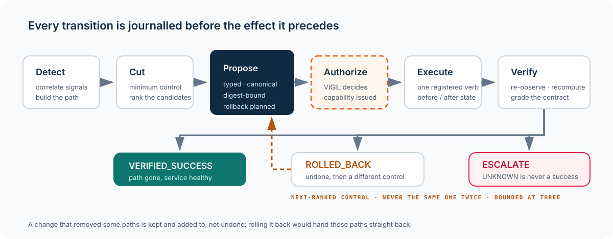
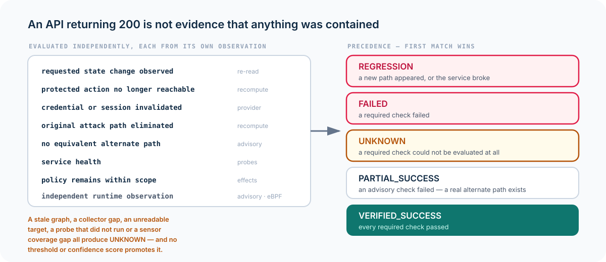

<div align="center">


<br>

[](#private-code-review)
[](#why-faultline-exists)
[](#technical-depth)
[](#technical-depth)
[](#closed-loop-response)

### Find the path. Prove the risk. Break the chain.

**AI & Cloud Adversarial Validation · Attack-Path Analysis · MCP Security · Coding-Agent Security · Control Effectiveness · Authorized Autonomous Response**

[**Request Private Code Review →**](https://github.com/bbrookhart/bbrookhart/issues/new?template=project-access.yml&title=%5BAccess%20Request%5D%20FAULTLINE)
&nbsp;&nbsp;·&nbsp;&nbsp;
[**Back to Research Portfolio**](https://github.com/bbrookhart)

</div>

---

## By the numbers

| | | |
|---|---|---|
| **5** registered consequential operations | **0** shell, generic-patch or cluster-admin code paths | **R0–R5** autonomy tiers, derived from the operation registry |
| **8** independently evaluated verification rows | **5** verdicts, with `UNKNOWN` never promoted to success | **3** response rounds maximum, never repeating a control |
| **≤30 min** capability TTL, single-use, ledger-redeemed | **1,775** automated Python tests | **60/60** OPA policy tests (16 on response admission) |
| 236/720 → **0/720** AI-agent attack trials | 371/600 → **0/600** MCP attack trials | 381/630 → **0/630** coding-agent attack trials |

Every figure above is measured against synthetic labs, a synthetic cyber range, and a real PostgreSQL journal. None of it is measured against a real cluster.

---

## FAULTLINE in 30 seconds

Security tooling often produces findings in isolation. FAULTLINE asks a harder question:

> **Can a weakness in AI, software, identity, or infrastructure propagate across trust boundaries into material security impact — and what is the smallest defensive change that breaks that path?**

**FAULTLINE is a continuous adversarial-validation platform for AI and cloud systems.** It combines probabilistic attack evaluation, MCP and coding-agent security testing, attack-path graph reasoning, replay, differential remediation testing, control-effectiveness measurement, purple-team validation, and minimum-control-cut analysis.

The platform now carries that reasoning one step further — into **closed-loop response**:

> **Once the smallest breaking change is known, who authorizes it, how narrowly is it executed, how is containment independently proven, and what undoes it when the proof fails?**

The objective is not to maximize finding counts. It is to determine whether an attack path is **real, reproducible, consequential, detectable, breakable — and actually broken.**

---

## Why FAULTLINE exists

Modern AI systems span more than a model endpoint. They include prompts, tools, MCP servers, agent memory, repositories, workload identities, cloud permissions, software supply chains, secrets, and downstream infrastructure.

A weakness in one layer may be low severity by itself and critical when composed with another.

FAULTLINE therefore evaluates security as a **path problem**:

```text
Untrusted input
   ↓
Agent behavior
   ↓
Tool / MCP boundary
   ↓
Workload identity
   ↓
Cloud permission
   ↓
Sensitive asset
   ↓
Operational consequence
```

Then it asks which control — provenance, sandboxing, approval, IAM restriction, network boundary, detection, or another defensive change — breaks the path with the lowest operational cost.

---

## System architecture

```mermaid
flowchart LR
    S[Scoped Engagement] --> A[Authorization + OPA Policy]
    A --> L[AI / MCP / Coding-Agent Labs]
    A --> C[Read-Only Cloud Collectors]
    L --> E[Findings + Trial Evidence]
    C --> G[Security Graph]
    E --> R[Replay + Differential Retest]
    E --> G
    G --> P[Attack-Path Reasoning]
    P --> M[Minimum Control Cut]
    R --> V[Control Effectiveness]
    V --> U[Purple-Team Validation]
    M --> O[Technical + Executive Reporting]
    U --> O
    M --> Q[Remediation Proposal]
    Q --> X{{External Authority · VIGIL}}
    X -->|signed capability| W[Narrow Response Worker]
    W --> Y[Independent Re-observation]
    Y --> Z[Verified Containment or Rollback]
    Z --> G
```



The architecture separates **evidence collection**, **authorization**, **adversarial execution**, **graph reasoning**, **assurance**, and — as of the response plane — **the authority to change anything**, so a system cannot silently promote an observation into an unsupported security verdict, or a verdict into an unauthorized action.

---

## Closed-loop response

FAULTLINE may reason about what should change. It does not possess unrestricted authority to change it.

<div align="center">



</div>

The design constraints are the interesting part:

| Constraint | How it is enforced |
|---|---|
| **No arbitrary execution** | A closed vocabulary of **five** registered operations — quarantine a pod, apply a temporary egress deny, restart a workload, revoke an ephemeral session, roll back a deployment. There is no shell adapter, no generic patch verb, and no cluster-admin binding. Unbounded execution is not disabled by a flag; it has no code path. |
| **No model-authored commands** | Proposals are typed, schema-versioned, canonicalized structures whose parameters are validated against an operation registry. Model text never reaches an executor. |
| **Authority lives outside** | Every execution requires an **Ed25519-signed capability** issued by an external authority ([VIGIL](https://github.com/bbrookhart/VIGIL)), bound to tenant, incident, task, executing agent, operation, canonical resource, a digest of the critical parameters, the proposal subject digest, and the authority's policy generation. TTL ≤ 30 minutes, explicit use budget, single-use redemption through a durable ledger. |
| **FAULTLINE cannot forge authority** | The verifier holds **public keys only** and has no signing method. The repository's only private key lives in the synthetic range, and an import-graph test asserts that nothing in the platform, applications, or plugins can reach it. |
| **Autonomy is not confidence** | Response tiers R0–R5 are derived from the operation registry and the environment. The function that computes a tier has **no confidence parameter**. Identity actions are R4 and are never selected autonomously; R5 has no executable path; tenant policy may only narrow. |
| **An API success is not containment** | Verification is a contract of **eight independently evaluated rows** resolving to five verdicts. The state change is confirmed by an independent re-read and a recomputed attack-path delta, not by the response of the call that made it. |
| **UNKNOWN is never promoted** | A stale graph, a collector gap, an unreadable target, a probe that did not run, or a runtime sensor coverage gap each produce `UNKNOWN` — and no code path converts `UNKNOWN` into success. Verdict precedence runs REGRESSION → FAILED → UNKNOWN → PARTIAL_SUCCESS → VERIFIED_SUCCESS. |
| **Every change is undoable** | Rollback plans are built **before** the change, from state actually captured, and every revert is pinned to the resource version the change left behind — so an operator edit in the meantime produces a conflict and an escalation rather than a silent overwrite. Irreversible operations report `IRREVERSIBLE` rather than succeeding at nothing. |
| **Being wrong is survivable** | If verification says a control did not contain, the loop selects the next-ranked candidate, obtains *fresh* authority, and re-verifies — bounded at three rounds, never repeating a control, and never continuing when the estate's state is unknown. |
| **Crashing is survivable** | Every transition is journalled before the effect it precedes. A process that dies after authority was granted, or after the pod was already quarantined, restarts and continues from the journal, re-executing the *recovered* proposal rather than a freshly planned lookalike — with the estate changed exactly once either way. A supervisor sweeps for abandoned incidents, and the journal's uniqueness constraint *is* the lease, so two supervisors cannot claim the same one. |

---

## The verification contract

<div align="center">



</div>

Verification asks eight separate questions — was the change actually applied, is the attack path gone, did the protected asset stay reachable to legitimate traffic, did the health signal hold, was the credential invalidated, did independent runtime observation agree, is the estate still legible, and did anything regress — and refuses to average them. A control that removed *some* paths is kept and added to, not undone. A control that broke the application is rolled back even if it worked.

---

## What the evaluation framework measures

FAULTLINE distinguishes categories that many red-team tools collapse together:

| Question | Example output |
|---|---|
| Did the attack behavior occur? | Trial success rate + confidence interval |
| Is the issue deterministic or stochastic? | Configuration fact vs probabilistic behavior |
| Can the finding be reproduced? | Replay bundle + configuration hash |
| Did a remediation actually change the tested system? | Differential retest |
| Did legitimate work remain functional? | Benign utility checks |
| Was the attack prevented? | Prevention evidence |
| Was it detected? | Telemetry / rule evidence |
| Was anyone alerted? | Alert-path evidence |
| Could the system contain it? | Containment evidence |
| What breaks the most attack paths? | Minimum-control-cut ranking |
| Was the containing change authorized? | Signed capability + redemption record |
| Did the change actually contain the incident? | Eight-row verification verdict over a recomputed graph |
| How long did the whole loop take? | Time to attack path, control cut, authority decision, containment, verified containment, verified restoration |

This prevents a "blocked attack" from being treated as sufficient proof of a healthy control environment — and prevents "we took an action" from being treated as proof that the incident is over.

---

## Controlled evaluation evidence

The private implementation currently includes three representative adversarial environments:

| Evaluation | Baseline | Hardened | Important note |
|---|---:|---:|---|
| **Synthetic AI-agent lab** | **236 / 720** successful attack trials | **0 / 720** | Controlled synthetic evaluation |
| **MCP / multi-agent lab** | **371 / 600** | **0 / 600** | Legitimate tool-use checks retained |
| **Coding-agent arena** | **381 / 630** | **0 / 630** | Legitimate engineering tasks retained |

Zero observed successes after hardening is not interpreted as "zero true risk." The framework reports bounded uncertainty and preserves sample size, configuration identity, and replayability.

The response plane carries its own evidence:

| Property | Evidence |
|---|---|
| End-to-end closed loop | A synthetic cyber range — cluster, identity provider, protected database, and health signal that behave like the real thing, with resource versions that move, reads that fail, and health derived from what you actually did — driven from detection through verified containment |
| Authority boundary | Adversarial tests for forged capabilities, replayed capabilities, expired capabilities, parameter substitution after signing, resource substitution, wrong-agent redemption, and stale policy generations |
| Single use under concurrency | Twelve database connections racing one single-use capability yield one success and eleven refusals; eight concurrent journal writers produce one unbroken hash chain — enforced by unique constraints, not application logic |
| Crash resumption | Kills injected at each transition, replayed in memory and over real PostgreSQL, with the estate changed exactly once |
| Least privilege on the executor | Namespaced Kubernetes RBAC with no `delete` on pods, no secret access, no `pods/exec`, and no ClusterRole |
| Scale of automated checking | **1,775** automated Python tests and **60/60** OPA policy tests, 16 of which cover response admission alone |

These are **controlled evaluations against a synthetic estate, not production-world efficacy claims.** The response loop has not yet been run against a real Kubernetes cluster or a real identity provider.

---

## Representative attack-path analysis

```text
Untrusted vendor document
        ↓ retrieves_from
Indirect prompt injection
        ↓ invokes
Procurement agent
        ↓ tool_access
Unauthorized tool invocation
        ↓ executes_as
Workload identity
        ↓ can_assume
Production role
        ↓ can_read
Sensitive customer-data asset
```

FAULTLINE can represent this as a security graph, replay the underlying evidence, rank defensive changes by how many viable paths they cut relative to operational cost, and — with external authorization — apply the top-ranked change and prove from re-observation whether the path is gone.

---

## MCP and coding-agent security

Two areas receive dedicated treatment because their trust boundaries are easy to underestimate.

### MCP

FAULTLINE evaluates cases including:

- poisoned tool descriptions;
- server identity substitution;
- metadata mutation after approval;
- tool-name shadowing;
- declared-vs-actual privilege mismatch;
- multi-agent delegation failures.

The key question is often **provenance**, not content: did the user cause the privileged action, or did third-party tool metadata cause it?

### Coding agents

The coding-agent arena tests ordinary engineering tasks inside disposable repositories while adversarial conditions already exist in the checkout. It evaluates instruction hierarchy, filesystem boundaries, secret access, network egress, test integrity, and repository-level trust assumptions.

A critical distinction is preserved: **the agent attempting an unsafe action** and **the sandbox successfully containing it** are different facts.

---

## Technical depth

| Layer | Technologies / concepts |
|---|---|
| **Control plane** | Go · ConnectRPC · scoped engagements · signed approvals |
| **Policy** | OPA / Rego · authorization boundaries · approval policy · response admission as a narrowing only |
| **Workflow** | Temporal · durable synthetic workflows · worker attestations |
| **Evidence** | PostgreSQL · immutable observations · signed metadata · replay bundles · hash-chained response journal |
| **Security graph** | Neo4j · bounded path queries · tenant-partitioned projections · losslessly serializable world model |
| **AI security labs** | Python · probabilistic trials · MCP · multi-agent · coding-agent arenas |
| **Response plane** | Closed operation registry · Ed25519 capabilities · single-use redemption ledger · optimistic concurrency via server-side resource-version preconditions · supervised recovery |
| **Runtime sensing** | eBPF / Tetragon event normalization with per-node coverage proof, so "we saw nothing" carries information only where observation was actually possible |
| **Operator UI** | Next.js · technical and executive reporting |
| **Cloud sensing** | Read-only AWS · Azure · Google Cloud inventory with conservative inference |
| **Assurance** | Differential testing · confidence intervals · benign controls · purple-team validation · external OCSF and OpenTelemetry timelines |

The platform is deliberately built so that **the ability to change the world is a small, named, externally gated surface** rather than a capability that grows with the rest of the system.

---

## Multi-cloud security graph

Current research slices include bounded, read-only sensing across:

- **AWS:** identity and Organizations hierarchy plus selected S3, KMS, Secrets Manager, SSM, and Lambda metadata;
- **Azure:** subscription-scoped Resource Graph, RBAC, role definitions, and deny assignments;
- **Google Cloud:** project-scoped Asset Inventory and IAM context.

Collectors store constrained metadata, hashes, counts, and conservative capability relationships rather than credentials, secret values, arbitrary provider payloads, or unsupported effective-permission claims.

Observed authorization context is treated as **evidence**, not automatically as a final authorization verdict.

---

## What this project demonstrates

FAULTLINE is intended to demonstrate the ability to work across multiple security layers rather than treating AI security as isolated prompt testing.

It combines:

- AI red teaming and agentic threat modeling;
- MCP and coding-agent trust-boundary analysis;
- cloud identity and authorization reasoning;
- attack-graph and blast-radius analysis;
- distributed systems and workflow engineering;
- policy-as-code and scoped execution;
- capability-based authorization and externally enforced autonomy limits;
- fault-tolerant state machines with journalled recovery and leases;
- replayable experimentation and quantitative evaluation;
- purple-team measurement and detection engineering;
- remediation verification and reversal rather than finding generation alone.

**Roles this work maps to:** AI Red Team Engineer · AI Security Engineer · Security Researcher · Cloud Security Engineer · Product Security Engineer · Adversarial ML / Safety Engineer · Detection & Assurance Researcher · Autonomous Defense Engineer.

---

## Good questions

The strongest FAULTLINE discussion topics are:

1. Why should adversarial AI findings be modeled as rates rather than simple vulnerable/not-vulnerable booleans?
2. How do you prove a remediation fixed the same system you originally tested?
3. How should attack graphs distinguish observed, inferred, and effective permissions?
4. Why are prevention, detection, alerting, and containment separate control dimensions?
5. How can an MCP tool description become a security-relevant causal input before the tool is called?
6. How do you preserve legitimate agent utility while reducing attack success?
7. What is the difference between a finding and a consequential attack path?
8. Why must model confidence be structurally incapable of raising an autonomy tier?
9. What does a containment system owe you when it genuinely cannot tell whether it worked?
10. If an autonomous responder crashes between "authority granted" and "change applied," what makes the restart safe?

---

## Claim boundary

FAULTLINE is an **early-stage research and engineering implementation**. The public claims are intentionally bounded:

- controlled lab results do not imply production-world effectiveness;
- cloud collectors are read-only and use conservative inference;
- graph relationships do not automatically equal effective authorization;
- zero observed attack successes in a sample do not prove zero underlying risk;
- the closed response loop is exercised against a **synthetic cyber range** and against real PostgreSQL — it has **not** yet been run against a real Kubernetes cluster, a real identity provider, or a real incident;
- compromise is injected through deterministic scenario fixtures; there is no real-world exploitation, no public-target scanning, and no real credential theft;
- the authority service the response plane depends on is external, and FAULTLINE's own tests use a reference implementation of it rather than a production deployment.

The goal is evidence-backed security reasoning, not inflated completeness claims. Where a boundary is incomplete, it is stated rather than softened.

---

## Private code review

The full implementation is intentionally **private**. Recruiters, hiring managers, and research collaborators may request review access to inspect the architecture, evaluation harnesses, response plane, code organization, documentation, and evidence model.

<div align="center">

### Interested in reviewing the implementation?

[](https://github.com/bbrookhart/bbrookhart/issues/new?template=project-access.yml&title=%5BAccess%20Request%5D%20FAULTLINE)

Please include your **GitHub username, organization/role, and review context**. Access is granted selectively and the private repository remains the canonical implementation.

[LinkedIn](https://www.linkedin.com/in/brian-brookhart/) · [Research Portfolio](https://github.com/bbrookhart)

</div>

---

<div align="center">

**FAULTLINE**

*Find the path. Prove the risk. Break the chain.*

</div>
