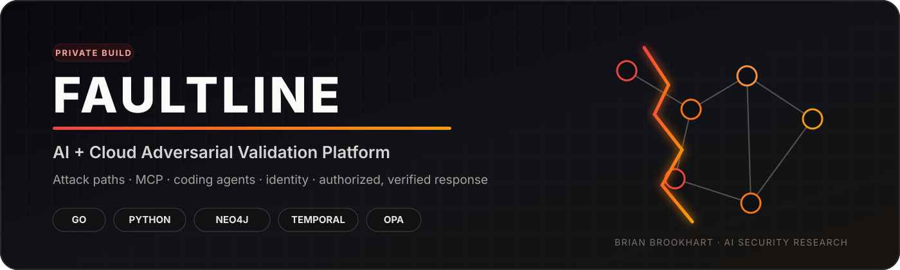
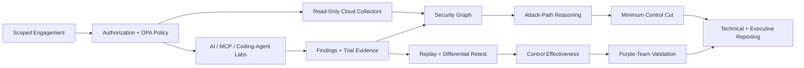

<div align="center">



<br>

[](#private-code-review)
[](#why-faultline-exists)
[](#technical-depth)
[](#technical-depth)

### Find the path. Prove the risk. Break the chain.

**AI & Cloud Adversarial Validation · Attack-Path Analysis · MCP Security · Coding-Agent Security · Control Effectiveness**

[**Request Private Code Review →**](https://github.com/bbrookhart/bbrookhart/issues/new?template=project-access.yml&title=%5BAccess%20Request%5D%20FAULTLINE)
&nbsp;&nbsp;·&nbsp;&nbsp;
[**Back to Research Portfolio**](https://github.com/bbrookhart)

</div>

---

## FAULTLINE in 30 seconds

Security tooling often produces findings in isolation. FAULTLINE asks a harder question:

> **Can a weakness in AI, software, identity, or infrastructure propagate across trust boundaries into material security impact — and what is the smallest defensive change that breaks that path?**

**FAULTLINE is a continuous adversarial-validation platform for AI and cloud systems.** It combines probabilistic attack evaluation, MCP and coding-agent security testing, attack-path graph reasoning, replay, differential remediation testing, control-effectiveness measurement, purple-team validation, and minimum-control-cut analysis.

The objective is not to maximize finding counts. It is to determine whether an attack path is **real, reproducible, consequential, detectable, and breakable**.

---

## Why FAULTLINE exists

Modern AI systems span more than a model endpoint. They include prompts, tools, MCP servers, agent memory, repositories, workload identities, cloud permissions, software supply chains, secrets, and downstream infrastructure.

A weakness in one layer may be low severity by itself and critical when composed with another.

FAULTLINE therefore evaluates security as a **path problem**:

```text
Untrusted input
   ↓
Agent behavior
   ↓
Tool / MCP boundary
   ↓
Workload identity
   ↓
Cloud permission
   ↓
Sensitive asset
   ↓
Operational consequence
```

Then it asks which control — provenance, sandboxing, approval, IAM restriction, network boundary, detection, or another defensive change — breaks the path with the lowest operational cost.

---

## System architecture



The architecture separates **evidence collection**, **authorization**, **adversarial execution**, **graph reasoning**, and **assurance** so a system cannot silently promote an observation into an unsupported security verdict.

---

## What the evaluation framework measures

FAULTLINE distinguishes categories that many red-team tools collapse together:

| Question | Example output |
|---|---|
| Did the attack behavior occur? | Trial success rate + confidence interval |
| Is the issue deterministic or stochastic? | Configuration fact vs probabilistic behavior |
| Can the finding be reproduced? | Replay bundle + configuration hash |
| Did a remediation actually change the tested system? | Differential retest |
| Did legitimate work remain functional? | Benign utility checks |
| Was the attack prevented? | Prevention evidence |
| Was it detected? | Telemetry / rule evidence |
| Was anyone alerted? | Alert-path evidence |
| Could the system contain it? | Containment evidence |
| What breaks the most attack paths? | Minimum-control-cut ranking |

This prevents a “blocked attack” from being treated as sufficient proof of a healthy control environment.

---

## Controlled evaluation evidence

The private implementation currently includes three representative adversarial environments:

| Evaluation | Baseline | Hardened | Important note |
|---|---:|---:|---|
| **Synthetic AI-agent lab** | **236 / 720** successful attack trials | **0 / 720** | Controlled synthetic evaluation |
| **MCP / multi-agent lab** | **371 / 600** | **0 / 600** | Legitimate tool-use checks retained |
| **Coding-agent arena** | **381 / 630** | **0 / 630** | Legitimate engineering tasks retained |

Zero observed successes after hardening is not interpreted as “zero true risk.” The framework reports bounded uncertainty and preserves sample size, configuration identity, and replayability.

These are **synthetic lab results, not production-world efficacy claims**.

---

## Representative attack-path analysis

```text
Untrusted vendor document
        ↓ retrieves_from
Indirect prompt injection
        ↓ invokes
Procurement agent
        ↓ tool_access
Unauthorized tool invocation
        ↓ executes_as
Workload identity
        ↓ can_assume
Production role
        ↓ can_read
Sensitive customer-data asset
```

FAULTLINE can represent this as a security graph, replay the underlying evidence, and rank defensive changes by how many viable paths they cut relative to operational cost.

---

## MCP and coding-agent security

Two areas receive dedicated treatment because their trust boundaries are easy to underestimate.

### MCP

FAULTLINE evaluates cases including:

- poisoned tool descriptions;
- server identity substitution;
- metadata mutation after approval;
- tool-name shadowing;
- declared-vs-actual privilege mismatch;
- multi-agent delegation failures.

The key question is often **provenance**, not content: did the user cause the privileged action, or did third-party tool metadata cause it?

### Coding agents

The coding-agent arena tests ordinary engineering tasks inside disposable repositories while adversarial conditions already exist in the checkout. It evaluates instruction hierarchy, filesystem boundaries, secret access, network egress, test integrity, and repository-level trust assumptions.

A critical distinction is preserved: **the agent attempting an unsafe action** and **the sandbox successfully containing it** are different facts.

---

## Technical depth

| Layer | Technologies / concepts |
|---|---|
| **Control plane** | Go · ConnectRPC · scoped engagements · signed approvals |
| **Policy** | OPA / Rego · authorization boundaries · approval policy |
| **Workflow** | Temporal · durable synthetic workflows · worker attestations |
| **Evidence** | PostgreSQL · immutable observations · signed metadata · replay bundles |
| **Security graph** | Neo4j · bounded path queries · tenant-partitioned projections |
| **AI security labs** | Python · probabilistic trials · MCP · multi-agent · coding-agent arenas |
| **Operator UI** | Next.js · technical and executive reporting |
| **Cloud sensing** | Read-only AWS · Azure · Google Cloud inventory with conservative inference |
| **Assurance** | Differential testing · confidence intervals · benign controls · purple-team validation |

The platform is intentionally designed so **consequential and production execution remain disabled** while the research implementation matures.

---

## Multi-cloud security graph

Current research slices include bounded, read-only sensing across:

- **AWS:** identity and Organizations hierarchy plus selected S3, KMS, Secrets Manager, SSM, and Lambda metadata;
- **Azure:** subscription-scoped Resource Graph, RBAC, role definitions, and deny assignments;
- **Google Cloud:** project-scoped Asset Inventory and IAM context.

Collectors store constrained metadata, hashes, counts, and conservative capability relationships rather than credentials, secret values, arbitrary provider payloads, or unsupported effective-permission claims.

Observed authorization context is treated as **evidence**, not automatically as a final authorization verdict.

---

## What this project demonstrates

FAULTLINE is intended to demonstrate the ability to work across multiple security layers rather than treating AI security as isolated prompt testing.

It combines:

- AI red teaming and agentic threat modeling;
- MCP and coding-agent trust-boundary analysis;
- cloud identity and authorization reasoning;
- attack-graph and blast-radius analysis;
- distributed systems and workflow engineering;
- policy-as-code and scoped execution;
- replayable experimentation and quantitative evaluation;
- purple-team measurement and detection engineering;
- remediation verification rather than finding generation alone.

**Roles this work maps to:** AI Red Team Engineer · AI Security Engineer · Security Researcher · Cloud Security Engineer · Product Security Engineer · Adversarial ML / Safety Engineer · Detection & Assurance Researcher.

---

## Good questions

The strongest FAULTLINE discussion topics are:

1. Why should adversarial AI findings be modeled as rates rather than simple vulnerable/not-vulnerable booleans?
2. How do you prove a remediation fixed the same system you originally tested?
3. How should attack graphs distinguish observed, inferred, and effective permissions?
4. Why are prevention, detection, alerting, and containment separate control dimensions?
5. How can an MCP tool description become a security-relevant causal input before the tool is called?
6. How do you preserve legitimate agent utility while reducing attack success?
7. What is the difference between a finding and a consequential attack path?

---

## Claim boundary

FAULTLINE is an **early-stage research and engineering implementation**. The public claims are intentionally bounded:

- controlled lab results do not imply production-world effectiveness;
- cloud collectors are read-only and use conservative inference;
- consequential and production execution remain disabled;
- graph relationships do not automatically equal effective authorization;
- zero observed attack successes in a sample do not prove zero underlying risk.

The goal is evidence-backed security reasoning, not inflated completeness claims.

---

## Private code review

The full implementation is intentionally **private**. Recruiters, hiring managers, and research collaborators may request review access to inspect the architecture, evaluation harnesses, code organization, documentation, and evidence model.

<div align="center">

### Interested in reviewing the implementation?

[](https://github.com/bbrookhart/bbrookhart/issues/new?template=project-access.yml&title=%5BAccess%20Request%5D%20FAULTLINE)

Please include your **GitHub username, organization/role, and review context**. Access is granted selectively and the private repository remains the canonical implementation.

[LinkedIn](https://www.linkedin.com/in/brian-brookhart/) · [Research Portfolio](https://github.com/bbrookhart)

</div>

---

<div align="center">

**FAULTLINE**

*Find the path. Prove the risk. Break the chain.*

</div>
