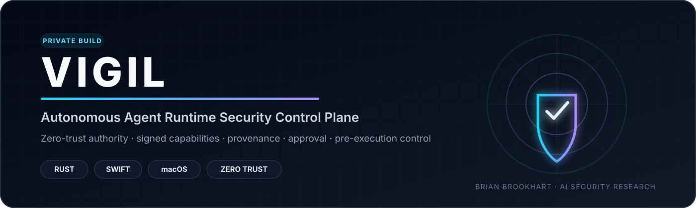
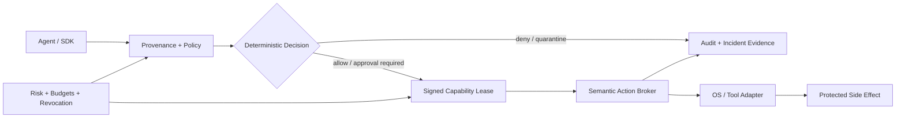

<div align="center">



<br>

[](#private-code-review)
[](#why-vigil-exists)
[](#technical-depth)
[](#technical-depth)

### Stop unsafe agent action before it becomes consequence.

**Runtime Security · Zero-Trust Authority · Capability Enforcement · Causal Provenance · Human Approval**

[**Request Private Code Review →**](https://github.com/bbrookhart/bbrookhart/issues/new?template=project-access.yml&title=%5BAccess%20Request%5D%20VIGIL)
&nbsp;&nbsp;·&nbsp;&nbsp;
[**Back to Research Portfolio**](https://github.com/bbrookhart)

</div>

---

## VIGIL in 30 seconds

Autonomous AI agents increasingly operate with the authority of the humans and services that launch them. That creates a systems-security problem: a compromised, manipulated, or simply mistaken agent can turn untrusted input into a consequential filesystem, process, network, credential, or tool action.

**VIGIL is a local-first runtime safety and security control plane that treats the AI agent as an untrusted principal.** Instead of asking the model whether an action is safe, VIGIL places an independently enforced authorization boundary between agent intent and protected execution.

The design combines **deterministic policy, causal provenance, signed use-bounded capabilities, quantitative action budgets, narrow human approval, semantic side-effect brokers, incident containment, and tamper-evident evidence**.

> **Core thesis:** models may reason probabilistically; authority to act should be granted deterministically, narrowly, and outside the model.

---

## Why VIGIL exists

Traditional endpoint security assumes software executes within permissions already granted to a user or service. Agentic AI changes the failure model because the software is now interpreting untrusted natural-language content, selecting tools, chaining actions, and dynamically deciding what to do next.

VIGIL explores a different security boundary:

| Conventional assumption | VIGIL design principle |
|---|---|
| The agent inherits ambient user authority | **Default deny; authority is explicitly minted** |
| Approval means “allow the agent” | **Approval binds one material action and resolved resource** |
| Prompt-injection detection can decide execution | **Detectors add evidence; deterministic policy decides authority** |
| A path or tool name is sufficient identity | **Resources and actions are resolved, hashed, scoped, and revalidated** |
| Risk scoring may increase or decrease trust | **Risk is monotone: it may only subtract authority** |
| Logging happens after execution | **Authorization and evidence are part of the pre-execution path** |

This is the security problem I consider increasingly important as AI moves from **generating output** to **taking action**.

---

## System architecture



The architecture intentionally separates **semantic intent** from **OS-observed execution**. Brokers understand task scope, tool arguments, capabilities, approval, and budgets. Native adapters understand process, file, and network events. Reconciliation is used to detect when observed execution diverges from authorized intent.

---

## Security properties

| Property | Mechanism |
|---|---|
| **Default deny** | Explicit policy lattice; unknown actions fail closed |
| **Least authority** | Exact resource/action bindings, expiry, nonce, maximum uses, budgets |
| **Replay resistance** | Signed capabilities, action-hash recomputation, nonce consumption |
| **Prompt-injection containment** | Causal provenance and taint inform policy without giving detectors permit authority |
| **Narrow approval** | Human approval authorizes the material action, not a broad autonomous mode |
| **Secret-use isolation** | Opaque handles and purpose-bound secret providers |
| **Monotone containment** | Elevated risk revokes or withholds authority rather than expanding it |
| **Durable evidence** | Tamper-evident event chain and signed checkpoints |
| **Memory-safety stance** | Rust workspace forbids unsafe code across the core implementation |

---

## Technical depth

<div align="center">

| Systems | Security | Evaluation |
|---|---|---|
| **Rust** multi-crate workspace | Deterministic authorization | Adversarial harnesses |
| Native **Swift** macOS adapters | Signed capabilities | Fuzz targets |
| Dependency-light Python SDK | Provenance + taint | Cross-language fixtures |
| SQLite-backed local evidence | Approval + revocation | Release gates |
| Endpoint Security contracts | Action budgets | Benchmarks |
| Network Extension contracts | Secret-use brokering | Bypass analysis |

</div>

### Current generated implementation evidence

The private implementation currently contains an inventory of:

- **749 Rust** source test entry points
- **199 Swift** source test entry points
- **25 adversarial harness tests**
- **21 named attack paths**
- **12 fuzz targets**
- **57 architecture decision records**
- **16 Rust workspace crates**
- **0 unsafe Rust constructs** in the generated source inventory

These numbers are **implementation/test inventory**, not a claim that VIGIL provides complete production-world safety. CI execution status and environment-specific validation are separate evidence classes.

---

## Example security path

A representative indirect prompt-injection case looks like this:

```text
Untrusted content
      ↓
Agent proposes sensitive action
      ↓
Provenance marks causal influence
      ↓
Policy evaluates identity + action + resource + risk + budget
      ↓
Sensitive action requires exact approval
      ↓
Single-use signed capability is minted
      ↓
Broker revalidates the action before execution
      ↓
Execution + evidence are reconciled
```

The design goal is not to make the model perfectly trustworthy. It is to make **model trust unnecessary for the final authority decision**.

---

## Engineering maturity and claim boundary

| Boundary | Current status |
|---|---|
| Portable policy, identity, provenance, capabilities, audit | **Implemented and tested** |
| Filesystem, structured process, network probe, Git, MCP, secret-use brokers | **Broker-enforced** |
| Endpoint Security policy + native adapter | **Implemented; entitlement-free parity tested** |
| Network Extension policy + product graph | **Implemented; unsigned build/test path** |
| Human approval + local evidence store | **Structurally bounded** |
| Full native macOS process confinement | **Not yet demonstrated** |

The most important limitation is explicit: **broker-mediated authority is real; whole-process macOS confinement is not yet a current claim.** Apple entitlement-dependent activated-device validation remains part of the roadmap.

---

## What this project demonstrates 

VIGIL is designed to show depth beyond a conventional “LLM security demo.” It requires reasoning across:

- autonomous-agent threat modeling and prompt-injection containment;
- operating-system security and execution boundaries;
- zero-trust authorization and capability systems;
- cryptographic binding, replay resistance, and revocation;
- secure systems engineering in Rust and Swift;
- human-in-the-loop approval design;
- adversarial testing, fuzzing, evidence generation, and honest claim boundaries;
- the safety/utility tradeoff inherent in constraining autonomous systems.

**Roles this work maps to:** AI Security Engineer · Agentic AI Security Researcher · Product Security Engineer · Security Researcher · AI Red Team / Safety Engineer · Secure Systems Engineer.

---

## Good questions

If we discuss VIGIL in an interview, the most interesting questions are not “what framework did you use?” They are:

1. Why should a probabilistic detector never be the authority that grants execution?
2. How do you prevent a human approval from becoming a reusable ambient permission?
3. What is the difference between semantic tool authorization and OS-level confinement?
4. How do provenance and taint affect authority without turning into brittle keyword blocking?
5. What evidence is required before claiming a macOS enforcement boundary is actually active?
6. How do you contain a compromised agent without destroying legitimate developer utility?

---

## Private code review

The full implementation is intentionally **private** while the research and enforcement model continues to mature. Recruiters, hiring managers, and research collaborators may request review access.

<div align="center">

### Interested in reviewing the implementation?

[](https://github.com/bbrookhart/bbrookhart/issues/new?template=project-access.yml&title=%5BAccess%20Request%5D%20VIGIL)

Please include your **GitHub username, organization/role, and review context**. Access is granted selectively and the private repository remains the canonical implementation.

[LinkedIn](https://www.linkedin.com/in/brian-brookhart/) · [Research Portfolio](https://github.com/bbrookhart)

</div>

---

<div align="center">

**VIGIL**

*Reason probabilistically. Authorize deterministically. Execute with bounded authority.*

</div>
