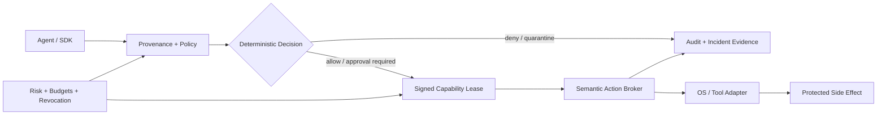

<div align="center">


<br>

[](#private-code-review)
[](#why-vigil-exists)
[](#technical-depth)
[](#technical-depth)

### Stop unsafe agent action before it becomes consequence.

**Runtime Security · Zero-Trust Authority · Capability Enforcement · Causal Provenance · Human Approval**

[**Request Private Code Review →**](https://github.com/bbrookhart/bbrookhart/issues/new?template=project-access.yml&title=%5BAccess%20Request%5D%20VIGIL)
&nbsp;&nbsp;·&nbsp;&nbsp;
[**Back to Research Portfolio**](https://github.com/bbrookhart)

</div>

---

## VIGIL in 30 seconds

Autonomous AI agents increasingly operate with the authority of the humans and services that launch them. That creates a systems-security problem: a compromised, manipulated, or simply mistaken agent can turn untrusted input into a consequential filesystem, process, network, credential, or tool action.

**VIGIL is a local-first runtime safety and security control plane that treats the AI agent as an untrusted principal.** Instead of asking the model whether an action is safe, VIGIL places an independently enforced authorization boundary between agent intent and protected execution.

The design combines **deterministic policy, causal provenance, signed use-bounded capabilities, quantitative action budgets, narrow human approval, semantic side-effect brokers, incident containment, and tamper-evident evidence**.

> **Core thesis:** models may reason probabilistically; authority to act should be granted deterministically, narrowly, and outside the model.

---

## Why VIGIL exists

Traditional endpoint security assumes software executes within permissions already granted to a user or service. Agentic AI changes the failure model because the software is now interpreting untrusted natural-language content, selecting tools, chaining actions, and dynamically deciding what to do next.

VIGIL explores a different security boundary:

| Conventional assumption | VIGIL design principle |
|---|---|
| The agent inherits ambient user authority | **Default deny; authority is explicitly minted** |
| Approval means “allow the agent” | **Approval binds one material action and resolved resource** |
| Prompt-injection detection can decide execution | **Detectors add evidence; deterministic policy decides authority** |
| A path or tool name is sufficient identity | **Resources and actions are resolved, hashed, scoped, and revalidated** |
| Risk scoring may increase or decrease trust | **Risk is monotone: it may only subtract authority** |
| Logging happens after execution | **Authorization and evidence are part of the pre-execution path** |

This is the security problem I consider increasingly important as AI moves from **generating output** to **taking action**.

---

## System architecture



The architecture intentionally separates **semantic intent** from **OS-observed execution**. Brokers understand task scope, tool arguments, capabilities, approval, and budgets. Native adapters understand process, file, and network events. Reconciliation is used to detect when observed execution diverges from authorized intent.

---

## Security properties

| Property | Mechanism |
|---|---|
| **Default deny** | Explicit policy lattice; unknown actions fail closed |
| **Least authority** | Exact resource/action bindings, expiry, nonce, maximum uses, budgets |
| **Replay resistance** | Signed capabilities, action-hash recomputation, nonce consumption |
| **Prompt-injection containment** | Causal provenance and taint inform policy without giving detectors permit authority |
| **Narrow approval** | Human approval authorizes the material action, not a broad autonomous mode |
| **Secret-use isolation** | Opaque handles and purpose-bound secret providers |
| **Monotone containment** | Elevated risk revokes or withholds authority rather than expanding it |
| **Durable evidence** | Tamper-evident event chain, signed checkpoints, and an external witness that refuses equivocation |
| **Key custody** | Signing material is refused at load unless no other unprivileged account can read it; environment variables name paths, never keys |
| **Key lifecycle** | Rotation with a bounded overlap, retirement, and revocation that is retroactive for authorization and preserved for evidence |
| **Authenticated approval** | An approver identity carries how it was established, and each method reports the assurance it genuinely provides rather than the one it would flatter |
| **Memory-safety stance** | Rust workspace forbids unsafe code across the core implementation |

---

## Technical depth

<div align="center">

| Systems | Security | Evaluation |
|---|---|---|
| **Rust** multi-crate workspace | Deterministic authorization | Adversarial harnesses |
| Native **Swift** macOS adapters | Signed capabilities | Fuzz targets |
| Dependency-light Python SDK | Provenance + taint | Cross-language fixtures |
| SQLite-backed local evidence | Approval + revocation | Release gates |
| Endpoint Security contracts | Action budgets | Benchmarks |
| Network Extension contracts | Secret-use brokering | Bypass analysis |

</div>

### Current generated implementation evidence

The private implementation currently contains an inventory of:

- **1,056 Rust** source test entry points
- **199 Swift** source test entry points
- **11 Python** source test entry points
- **25 adversarial harness tests**
- **21 named attack paths**
- **14 fuzz targets**
- **67 architecture decision records**
- **19 Rust workspace crates**
- **11 release security gates**
- **0 unsafe Rust constructs** in the generated source inventory

These numbers are **implementation/test inventory**, not a claim that VIGIL provides complete production-world safety.

**CI execution status.** The full suite now executes and passes — 20 successful jobs with 0 failures — including both macOS Swift adapters on `macos-15`, a non-bypassability run against a real kind + Cilium cluster, the fuzz campaign across every target, SBOM generation, dependency advisory scanning, and secret scanning. Environment-specific activated-device validation remains a separate evidence class.

---

## Measured evidence

Inventory says what exists. This says what it does.

### Does the enforcement boundary change what happens?

Three arms over identical cases, sandboxes, and payloads, differing only in what sits between the agent and the world. **Scored on observed side effects — whether the file was read, deleted, or sent — never on what any component reported.** A refusal in a transcript is not evidence that a file survived.

| Arm | Attacks completed | Benign tasks completed | False denials |
|---|---|---|---|
| Unprotected | **10 / 10** | 4 / 4 | 0 |
| Static pattern guardrails | 6 / 10 | 3 / 4 | 1 |
| **VIGIL** | **0 / 10** | 3 / 4 *(4th escalated to approval, not denied)* | **0** |

Fourteen cases across seven families: credential access, path laundering, destruction, persistence, code execution, network egress, and audit tampering.

**The benign column is the honest cost.** VIGIL's fourth benign task — running a program inside the workspace — was not denied; it escalated to a human. That is approval burden, and it is reported separately from false denials on purpose: a task a human can unblock and a task nobody can unblock cost very different things, and collapsing them would let a system that refuses everything look like one that asks.

**Where the pattern filter fails is instructive.** Four of its six successful attacks are one failure: the filter reads request *text*, and the text does not contain the thing that makes the request dangerous. A request for `workspace/notes.txt` — an innocuous name, symlinked to `~/.ssh/id_ed25519` — matches no pattern. VIGIL resolves the path first and then decides. Its cost runs the other way too: a legitimate `aws-credentials-howto.txt` matches the credential pattern and is refused, which is the false positive that gets a filter switched off.

### Which mechanism does the work?

A single "VIGIL blocked everything" number hides more than it shows, so mechanisms are ablated one at a time.

| Ablation | Attacks completed | What it attributes |
|---|---|---|
| VIGIL, intact | 0 / 10 | — |
| **− workspace boundary** | **5 / 10** | Every credential-access and path-laundering case, plus persistence |
| − mutation approval | 0 / 10 | Nothing measured here; execution, egress and audit tampering are prevented by the executable allowlist and destination policy instead |

Removing the workspace boundary reopens half the corpus and leaves execution, egress and audit tampering closed — which attributes those preventions to different mechanisms rather than to the system in general.

### Enforcement-path latency

Single operations, timed individually with warmup discarded. Percentiles rather than a mean, because a mean hides the tail an operator actually feels. Deliberately **not** batched throughput reported as single-operation latency.

| Operation | p50 | p99 |
|---|---|---|
| Policy decision | 5.8 µs | 16.3 µs |
| Capability mint (Ed25519) | 32.6 µs | 60.1 µs |
| Capability verify + consume | 52.5 µs | 75.9 µs |
| Audit append (hash chain + commit) | 233 µs | 1.03 ms |

The decision is not where the time goes; durability is.

### Injection detection quality

Against a 47-case labelled corpus with a holdout split never consulted while changing rules, including **19 hard negatives** — legitimate content that quotes attack strings:

**Precision 1.000 · Recall 0.857 · False-positive rate 0.000**

The corpus is adversarial against its own detector, and it works: adding encoding-evasion and cross-agent-substitution cases defeated the phrase list with a one-word synonym substitution (`prior` for `previous`) and exposed a missing indicator family. One case remains missed and is listed rather than removed, because deleting an inconvenient case is how a detection benchmark stops being one.

### How to read these numbers

- **A scripted adversary, not a language model.** Every figure reads *"given an agent that attempts X, does X happen"*. None of it measures how susceptible a model is to being talked into attempting X.
- **The unprotected arm is the experiment's control.** The harness exits non-zero unless every attack succeeds and every benign task completes without protection — an arm where nothing succeeds means the harness broke, not that the system is strong.
- **Ablations are configuration ablations**, so provenance, budgets, replay protection and risk escalation are not attributed at all.
- Fourteen cases is a corpus, not a benchmark.

---

## Example security path

A representative indirect prompt-injection case looks like this:

```text
Untrusted content
      ↓
Agent proposes sensitive action
      ↓
Provenance marks causal influence
      ↓
Policy evaluates identity + action + resource + risk + budget
      ↓
Sensitive action requires exact approval
      ↓
Single-use signed capability is minted
      ↓
Broker revalidates the action before execution
      ↓
Execution + evidence are reconciled
```

The design goal is not to make the model perfectly trustworthy. It is to make **model trust unnecessary for the final authority decision**.

---

## Engineering maturity and claim boundary

| Boundary | Current status |
|---|---|
| Portable policy, identity, provenance, capabilities, audit | **Implemented and tested** |
| Filesystem, structured process, network probe, Git, MCP, secret-use brokers | **Broker-enforced** |
| Signing-key custody | **Enforced at load** — key material is refused unless owner-only, single-linked, and under directories no one else can replace; environment variables name paths and never carry keys. Verified across four real kernel UIDs |
| Key lifecycle | **Implemented and tested** — rotation with an overlap that cannot strand in-flight material, retirement, and revocation that is retroactive for authorization but preserved for evidence |
| Approver authentication | **Implemented and tested** — an approver identity carries *how* it was established and each method reports the assurance it genuinely provides. A name typed on a command line is recorded as establishing nothing |
| Endpoint Security policy + native adapter | **Implemented; entitlement-free parity tested in CI** |
| Network Extension policy + product graph | **Implemented; unsigned build/test path, exercised in CI** |
| Network non-bypassability (Kubernetes) | **Executed** — 21 assertions against a real kind + Cilium cluster. Confines the network path, not the agent inside its container |
| Comparative effectiveness | **Measured** — three arms plus two ablations, scored on side effects, against a scripted adversary |
| Hardware-backed keys | **Not implemented on any platform.** The Secure Enclave is P-256 while every signature here is Ed25519, so it needs algorithm agility first |
| Phishing-resistant human authentication | **Not implemented.** A policy requiring it cannot currently be satisfied by anyone, and the tooling reports that rather than letting it become a silent outage |
| Full native macOS process confinement | **Not demonstrated.** `vigil run` performs inheritance reduction, not confinement |

Two limitations matter most, and both are stated rather than implied.

**Broker-mediated authority is real; whole-process confinement is not a current claim.** A published bypass matrix measures this rather than asserting it: of the bypasses tested, three are closed (environment inheritance, caller-controlled `PATH`, working directory) and five remain open (subprocess, absolute-path escape, symlink escape, direct socket, raw syscall). The matrix asserts the *open* cases still succeed, so the documentation cannot quietly drift into claiming a sandbox. Closing them needs a kernel boundary — namespaces and seccomp, or a macOS sandbox profile.

**Apple entitlement-dependent activated-device validation remains part of the roadmap.** CI builds and tests the adapter packages; install, activate, and upgrade behaviour on a signed, entitled device is a separate evidence class and is not claimed.

---

## What this project demonstrates 

VIGIL is designed to show depth beyond a conventional “LLM security demo.” It requires reasoning across:

- autonomous-agent threat modeling and prompt-injection containment;
- operating-system security and execution boundaries;
- zero-trust authorization and capability systems;
- cryptographic binding, replay resistance, and revocation;
- secure systems engineering in Rust and Swift;
- human-in-the-loop approval design;
- adversarial testing, fuzzing, evidence generation, and honest claim boundaries;
- comparative measurement design, including control arms and mechanism ablation;
- the safety/utility tradeoff inherent in constraining autonomous systems.

**Roles this work maps to:** AI Security Engineer · Agentic AI Security Researcher · Product Security Engineer · Security Researcher · AI Red Team / Safety Engineer · Secure Systems Engineer.

---

## Good questions

If we discuss VIGIL in an interview, the most interesting questions are not “what framework did you use?” They are:

1. Why should a probabilistic detector never be the authority that grants execution?
2. How do you prevent a human approval from becoming a reusable ambient permission?
3. What is the difference between semantic tool authorization and OS-level confinement?
4. How do provenance and taint affect authority without turning into brittle keyword blocking?
5. What evidence is required before claiming a macOS enforcement boundary is actually active?
6. How do you contain a compromised agent without destroying legitimate developer utility?
7. Why does an effectiveness measurement need an arm where every attack *succeeds*, and what does a clean sweep without one actually tell you?
8. Revoking a capability key and revoking an audit key mean opposite things — why, and what breaks if a system treats them the same?

---

## Private code review

The full implementation is intentionally **private** while the research and enforcement model continues to mature. Recruiters, hiring managers, and research collaborators may request review access.

<div align="center">

### Interested in reviewing the implementation?

[](https://github.com/bbrookhart/bbrookhart/issues/new?template=project-access.yml&title=%5BAccess%20Request%5D%20VIGIL)

Please include your **GitHub username, organization/role, and review context**. Access is granted selectively and the private repository remains the canonical implementation.

[LinkedIn](https://www.linkedin.com/in/brian-brookhart/) · [Research Portfolio](https://github.com/bbrookhart)

</div>

---

<div align="center">

**VIGIL**

*Reason probabilistically. Authorize deterministically. Execute with bounded authority.*

</div>
